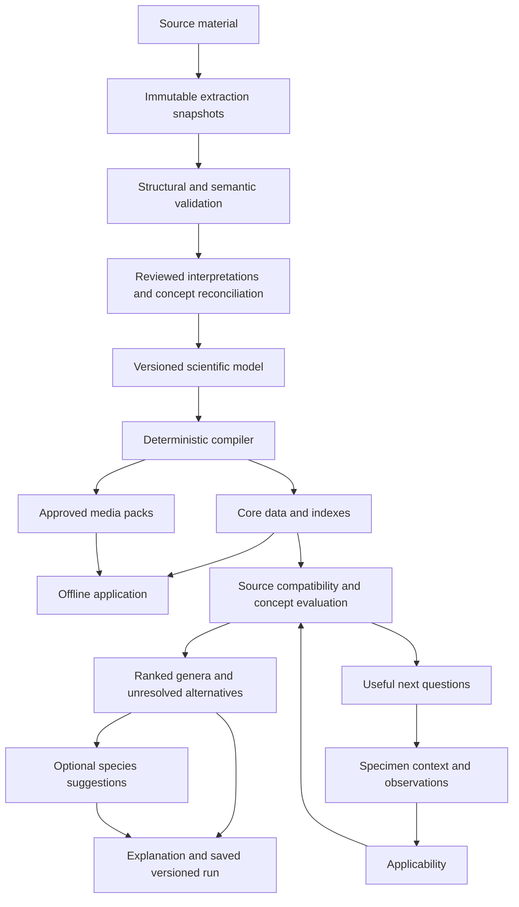

# Target architecture

## Decision

Evolve the existing application into one continuous, local-first, mobile-first multi-access genus identification experience. Maintain three layers:

1. Immutable source snapshots, preserving packet and original evidence.
2. Versioned scientific interpretation: concepts, names, assertions, conflicts, applicability and reconciliation.
3. Reproducible runtime packages: compact indexes, reviewed explanatory content and separately approved media.

The runtime bundle is a derivative, never the only scientific record. No backend, login or online inference is required.

## Scientific contract

| Record | Required meaning |
|---|---|
| TaxonConcept | Persistent ID, rank, according-to reference, circumscription, biological status. Genus is a rank, not a separate identity system. |
| TaxonomicName | Name identity, original spelling, authorship and available nomenclatural evidence. |
| NameUsage | Exact source spelling and qualifier, passage, resolved name/concept links where justified. |
| NomenclaturalActAssertion | Proposal/publication status, event kind, usages affected, qualifying evidence. |
| SourceEntity | Lucid identity/UUID/order/label, source snapshot and historical concept association. |
| SpeciesRecord | Species/subspecies concept with placement and name-usage links; hints optional. |
| CharacterDefinition/State | Anatomical predicate, source wording, measurement boundaries, state overlap and conjunction semantics. |
| CharacterAlignment | Reviewed cross-source equivalence, implication or overlap; no text-similarity auto-merging. |
| CharacterAssertion | Subject, value/polarity, comparison scope, quantifier, sex/stage, variation, exceptions, provenance. |
| MatrixSnapshot | Entity/state ordering, original code legend, exact cells and checksum. |
| ApplicabilityRule | Boolean expression over specimen context, stage, sex, structure and preparation. |
| DependencyRule | Trigger/target/effect, source meaning, priority and interpretation status. |
| ConceptRelation | Scoped equivalence, inclusion, overlap, non-equivalence or unresolved correspondence. |
| PlacementAssertion | Membership and uncertainty under a specific treatment. |
| PhylogeneticAssertion | Analysis/sampled scope, relation, support metric, actual support target and qualification. |
| SourcePassage | Source hash, chapter/page system/figure/panel, raw text or recoverable locator. |
| InterpretationActivity | Inputs, method/curator, time, review status and rationale. |
| Conflict | Competing assertion IDs, affected outputs, provisional policy and resolution history. |
| MediaAsset/Panel/Association | Binary identity separate from depictions, views, panel geometry and scientific associations. |
| RightsAssessment | Per-asset/panel conditions and reviewed inclusion eligibility. |
| Observation | Specimen, state expression, certainty, image/view/preparation, history. |
| IdentificationRun | Inputs, source/treatment/engine/policy versions, outputs and explanation trace. |

Persistent IDs must survive recompilation and source-order changes. Keep aliases to packet IDs and original numeric IDs/UUIDs. Unknown references produce validation errors or explicit unresolved results, never an absent score.

Store source unknown, source unreported, biological variation, observation uncertainty, mapping uncertainty, nomenclatural status and coverage separately. Do not invent experimental probabilities from categorical scores.

## Engine

Use a pure deterministic domain engine independent of React. Start with transparent compatibility and evidence bands; postpone calibrated probabilities until independently identified specimen data exist.

Evaluation order: context -> applicability -> observation interpretation -> historical Lucid evidence -> concept-specific evidence -> reviewed reconciliation -> ranked outputs -> next questions -> optional species outputs.

### Observation semantics

- Single observed state, with certainty.
- Alternatives (“either of these”): OR compatibility.
- Joint presence (“both”): only for an explicitly joint-compatible character; genus polymorphism alone does not justify it.
- Not sure: no diagnostic constraint.
- Cannot see: no constraint, updates observation feasibility.
- Skip: no constraint, temporarily deprioritizes the question.
- Inapplicable: checked context statement, never morphological absence.

Do not pool different specimens. Unknown sex can be represented through an adapter to Lucid S004 while remaining specimen context. F001/F002 are context controls even though the historical matrix scores them.

Applicability must support disjunctions and unknown truth values. Applicable, inapplicable and applicability-unknown are distinct. Suspend answers made inapplicable by context edits, preserving history and allowing reinstatement. Source positive dependencies default hidden; negative effects take priority. Biological applicability overlays may impose additional restrictions with provenance. Do not silently relax historical rules.

### Evidence and ranking

Common = supported compatibility. Rare = possible with a qualitative qualification. Source uncertain = retained without positive support. Misinterpretation = apparent observation pathway, not biological presence. Missing Schubert assertion = unscored. Applicable absent scores indicate disagreement, subject to reviewed anomaly/exception handling.

Preserve all-zero profiles as source zeros while attaching AU01's protective interpretation. Never label inferred source ignorance as an original author assertion.

Each candidate carries independent support, strong/tentative contradictions, unscored observations, diagnostic requirements, exceptions, mapping uncertainty and coverage. Rank with contradiction-sensitive evidence bands, then relevant independent support. Numerous weak matches cannot overwhelm a decisive applicable contradiction. Poorly scored candidates remain possible but cannot become “strong” merely by avoiding disagreement.

Do not display probability percentages. Show compatibility/coverage explanations such as “fits five observations; one tentative disagreement; two unscored.” Zero observations is unassessed, not perfect support. Preserve an outside-coverage/unresolved outcome even if one represented candidate leads.

Group correlated observations and repeated source assertions. A leg formula and longest-leg answer from the same measurement are not independent. Diagnostic combinations count according to their logic, not the number of extracted fragments.

Conflict recovery identifies a small useful set of disagreeing observations and explains what rechecking would restore. Never alter answers silently. Keep compatible alternatives and near matches inspectable.

### Reconciliation

Keep historical entity hypotheses and concept hypotheses distinguishable. A Lucid result is not automatically a contemporary genus identification.

- Equivalent mappings can carry scoped historical evidence with provenance.
- Splits create possible destinations and unresolved residues, not cloned score rows.
- Partial overlap cannot transfer universal absence to the entire target concept.
- Non-equivalence is not a positive mapping.
- Multiple historical routes to one concept do not create independent support.
- No crosswalk means unreviewed; empty destinations mean unresolved.
- Relevant later concepts with independent evidence must not be unreachable solely because early Lucid filtering rejected one historical route.

Question activation is prioritization, not permanent exclusion of concept space. Salticidae is retained for reconstruction but excluded from genus competition.

### Next-question utility

Conceptually: expected useful genus-resolution gain x probability of a usable observation x evidence reliability, divided by one plus effort and error risk.

V1: simulate candidate reduction for plausible answer scenarios, include abstention, and document heuristic weights. Overlapping states must not be normalized as disjoint frequencies. Entropy is optional when its candidate/answer assumptions are defensible; it is not calibrated certainty.

Discount source gaps, correlated questions and ambiguous applicability. Context questions can have indirect utility by unlocking future observations. Prefer a nearly equally discriminating accessible view before microscopy. Measure benefit in genus resolution, avoiding bias from one legacy record expanding to many concepts. Allow manual character selection and stop when available questions add little value.

### Schubert

Reusable characters join the normal question pool. Preserve original source IDs and reviewed alignments. Adult-male characters require appropriate context. Female assertions remain usable within their limitations; no synthesized female key.

Retain the complete original male key as a reference/resolver, including K10 alternatives and K11 conjunctive conditions. Do not derive universal profiles from every route. Keep AU03–AU05 visible and quarantine conflicting exclusions. Geography in the reference key remains faithfully represented; the app must not let locality independently decide identification.

### Species suggestions

Downstream and removable. No hints means no suggestion, not negative evidence. Possible: morphological resemblance. Plausible: useful compatible combination. Strong: reviewed diagnostic evidence plus adequate comparison coverage. Diagnostic-if-confirmed: exact outstanding predicate and source comparison scope disclosed.

Explain observed support, missing evidence, sex/stage, alternatives, microscopy/genital/association requirements and thesis status. Species-wide feasibility flags are insufficient. Locality is supportive only, with type-locality and incomplete-range qualifications. Do not manufacture coverage for the other 195 placements.

## UX

Primary navigation: Identify, Saved, Explore, Offline. Progressively collect sex/maturity/views and optional locality. Show one illustrated useful question, large state choices, prominent not-sure/cannot-see controls, why-this-question help and persistent access to observation history/candidates.

Candidate cards foreground genus, relevant sex/stage illustration, support/disagreement/coverage, and next useful observation. Species cards are secondary. Use qualified working concept labels when taxonomy requires them. Expose full source provenance on demand without forcing a source selection at session start.

Expert mode exposes all applicable characters and evidence; equipment mode separately unlocks microscopy/genital questions. Left/right palp and viewing orientation must be explicit. Review scientific illustrations; no invented diagnostic imagery. Missing images retain useful text and cannot be replaced with misleading taxa.

Keep controls usable on small screens, accessible without colour alone, readable at zoom, and compatible with keyboard/screen readers. Respect reduced motion. Prioritize clarity and field usability over ornament.

## Runtime and offline package

Reuse TypeScript and the existing UI framework where appropriate. Use a dedicated worker when needed to keep interactions responsive. No requirement for a graph database or custom binary format.

| Data | Initial representation |
|---|---|
| Definitions, concepts, usages, prose | Compact JSON + ID maps. |
| Original matrix | Uint8Array, 25,456 bytes plus metadata. |
| State compatibility indexes | Derived bitsets: three 32-bit words cover 86 Lucid entities. |
| Assertions | Sparse indexes; explicit unscored semantics. |
| Dependencies/relations | Adjacency lists and Boolean expression trees. |
| Sessions | IndexedDB observation log and versioned result snapshots. |
| Shell/media | Service worker and Cache Storage; asset/panel manifest. |

Keep core diagnostic coverage installed. Lazy-load optional high-resolution media, not indispensable evidence. Core illustrations and optional galleries/microscopy packs need independent download/readiness indicators.

Request persistent browser storage where supported, handle quota failures and provide portable session export/import. Do not claim readiness from service-worker registration alone. Verify cold launch, deep links and core data offline. User photos stay local unless the user explicitly exports them.

Stage package files, verify hashes and required assets, then atomically switch an active-package pointer. Cache Storage and IndexedDB do not form one transaction. Retain prior complete packages for rollback and referenced sessions; garbage-collect only unreferenced content. Prevent interrupted or mixed-version activation.

## Versioning and updates

Source -> extraction -> structural validation -> semantic review -> concept reconciliation -> reviewed model -> deterministic compile -> regression checks -> release.

Unchanged circumscription plus renamed display can retain concept identity. Split/merge/circumscription changes get new concepts and explicit relations. New combinations add usage/act/placement assertions. Corrections supersede interpretations while preserving raw sources. Do not implement “latest source always wins.”

Runs pin source, treatment, interpretation, engine, ranking policy and media versions. Updates offer a new evaluation next to the historical result. A future treatment must not require rewriting Lucid scores.

## Failure outcomes

Females/juveniles: retain ambiguity. Poor images: unobservable, not absent. Contradictions: targeted reinspection. Missing taxa/undescribed species: open-world or genus-only result. Outdated names: usage-aware search. Uncertain concepts: qualified results. Homoplasy: scoped combinations, no inferred ancestry. Missing media: safe explanatory fallback. Taxonomy changes: historical reproducibility and explicit reevaluation.
